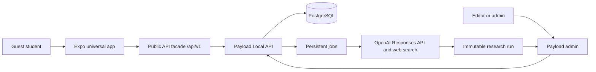

# OffMap architecture

## System shape

## Monorepo boundaries

The Expo app consumes only `@offmap/contracts`, `@offmap/taxonomy`, and `@offmap/design`; it never imports Payload types or raw collection shapes. The CMS owns persistence and converts public documents into stable DTOs. Payload Local API powers route handlers and jobs without an internal HTTP round trip.

PostgreSQL is the source of truth. Development uses Docker; production uses a managed provider with backups and point-in-time recovery. The CMS is deployed as a normal Node service. Its persistent job runner starts in the same service and may be separated only after measured load requires it.

## Runtime data flow

- Public reads use cacheable facade routes and return published DTOs only.
- TanStack Query owns remote state; saved IDs use device-local storage.
- Submission is online-only and writes a bounded private record after validation, honeypot handling, and database-backed throttling.
- AI research is admin-invoked and writes only a research run. A separate authenticated action may materialize a draft; only admins can publish.

## Deployment

Expo web is exported for EAS Hosting in server mode with deep links and metadata. Native preview/release builds use EAS Build. Payload runs separately because it requires a persistent Node process, PostgreSQL, jobs, and admin authentication.
